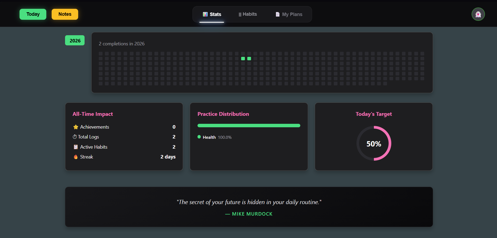
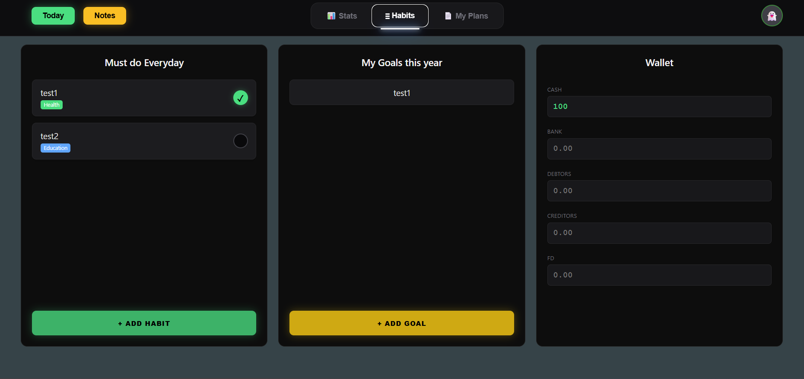
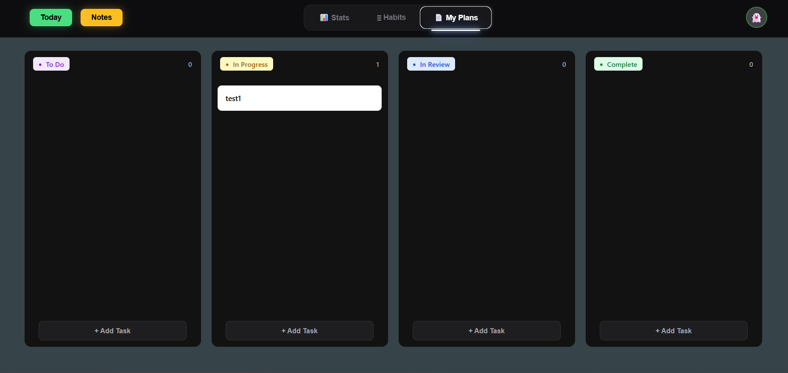
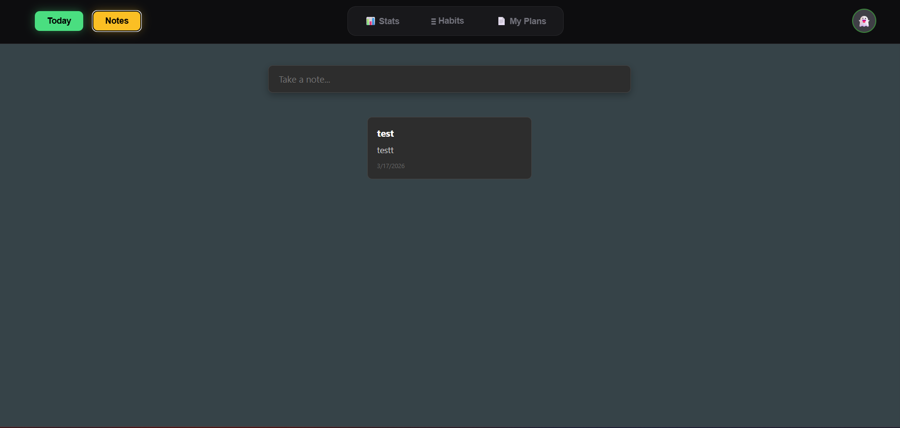
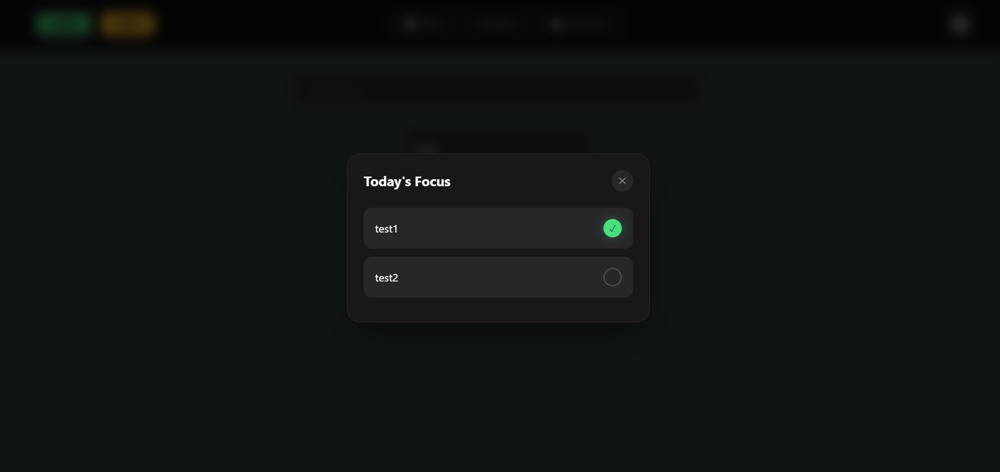

⚡ Neon Habit Tracker & Command Center
A high-performance, cloud-synced personal dashboard with a sleek neon-dark aesthetic.

🌟 Overview
This project is a multi-platform productivity suite designed to bridge the gap between desktop performance and mobile accessibility. Built using React and Tauri (Rust), it provides a unified interface for habit tracking, financial logging, and goal setting, all synchronized in real-time via Supabase.

✨ Key Features
📊 Advanced Analytics
Contribution Grid: GitHub-style visual tracker for habit consistency over 365 days.

Practice Distribution: Categorized breakdown of habits (Health, Financial, Education, etc.).

Streak Logic: Real-time calculation of daily completion streaks.

≡ Atomic Habits & Goals
Daily Checklist: Interactive habit tracking with instant cloud persistence.

Yearly Goals: Dedicated space for high-level targets with customized categories.

💰 Digital Wallet
Numeric Ledger: A specialized interface for tracking Cash, Bank, Debtors, and Creditors.

Numeric Input Guard: Built-in validation to ensure financial data integrity.

📄 Workspace & Notes
Neon Notes: A quick-capture area for thoughts and reminders.

Daily Plans: Task management for high-priority daily actions.

🛠 Tech Stack
Frontend: React 18, TypeScript, Vite

Animations: Framer Motion (Smooth screen transitions & sliding nav indicators)

Backend: Supabase (PostgreSQL, Auth, Real-time Sync)

Desktop App: Tauri (Rust-based system bridge)

Styling: CSS Modules with Neon-Atmospheric effects

🚀 Access the App
🌐 Web Version
Live on Netlify: [habit-tracker12345.netlify.app](https://habit-tracker12345.netlify.app)

💻 Desktop Version
To build the Microsoft Windows application (.exe):

Install Rust and the Tauri CLI.

Run: npm run tauri dev

⚙️ Local Development Setup
Clone the Repo:

Bash
git clone https://github.com/your-username/habit-tracker.git
Install Packages:

Bash
npm install
Configure Environment:
Create a .env file in the root directory:

Code snippet
VITE_SUPABASE_URL=https://your-project.supabase.co
VITE_SUPABASE_ANON_KEY=your-public-key
Run Dev Server:

Bash
npm run dev

## 📸 Screenshots

### Dashboard & Stats

### Habit Management

### my plans Management

### Notes Management

### today Management

